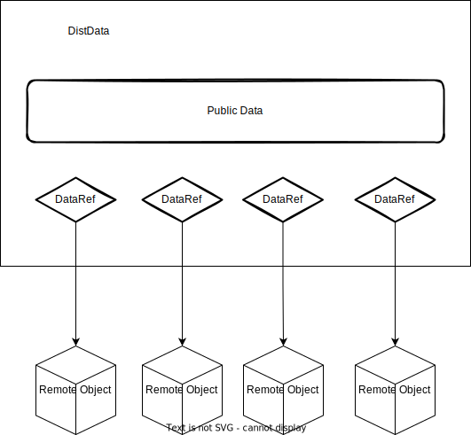
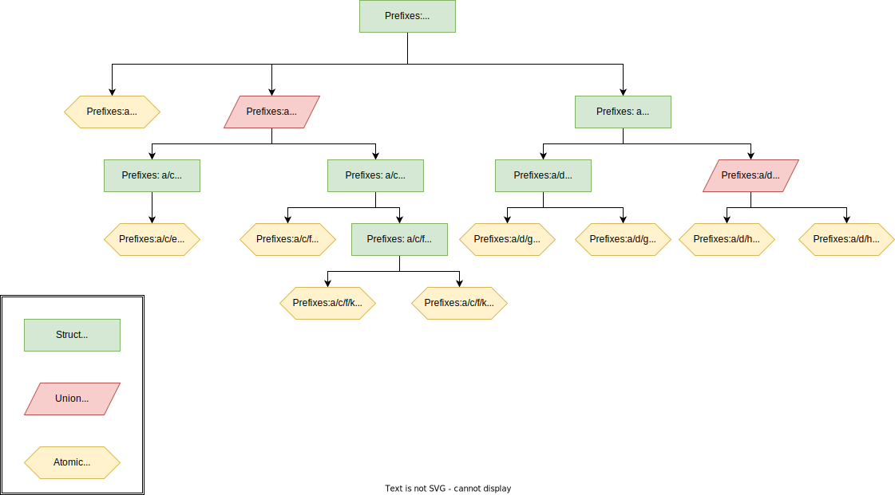
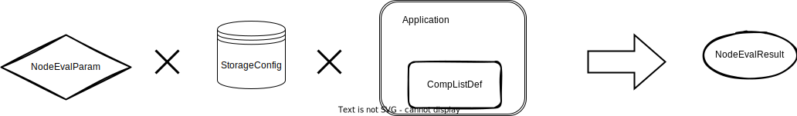

# Introduction to SecretFlow Open Specification

---

**NOTE**

1. The specification is subject to modification.
2. At this moment, we don't have an official protocol for Workflow.

---

## [Data]((spec.md#data))

We introduce [DistData](spec.md#distdata) to represent inputs and outputs in privacy-preserving applications.

In privacy-preserving applications, a data is "distributed" since it is owned by multiple parties like MPC models or vertical-partitioned tables.

---

**NOTE**

Don't confused with data partitioning in Database systems. In such systems, dividing a large dataset into several small partitions placed on different machines is quite
common. However, there are no owner enforcements on partitions, which means which machine is selected to place a partition is random.

---

DistData consists of two parts:
- Public data, which is acesssible to everyone.
- Private data, which is accessible to owner.

### Public data

Public data includes:
- name
- type, instructs privacy-preserving applications to process data
- system_info
- meta, anything else should be public.

#### [SystemInfo](spec.md#systeminfo)
For input data, **SystemInfo** describes the application and environment which could consume the data.

### Private data

A Distdata may contain multliple pieces of private data. Each piece of private data is referred by a DataRef.
DataRef is public in DistData. Don't put anything private in uri of DataRef since every party gets exactly the same DataRef.

DataRef only contains a uri. In order to retrieve the remote data, the owner has to utilize their own StorageConfig.

### [DataRef](spec.md#distdatadataref)

A **DataRef** is a pointer to a single file belongs to one party. **uri** is the relative path to storage root of its owner.
**DataRef** is public and open to all parties.

---

**NOTE**

Don't try to store any secret with uris. You need to protect the files pointed by uris instead.

---

### [StorageConfig](spec.md#storageconfig)

**StorageConfig** specifies the storage root of a party. It could be a local file path, a database table or an OSS bucket.

At this moment, we only support *local_fs*.

### Common DistData Types

We purpose some common DistData types.

#### [IndividualTable](spec.md#individualtable)

**IndividualTable** is a table owned by one party, which means there is a single item in data_refs field of DistData.
**IndividualTable** should be packed into **meta** field of DistData which includes **schema** and **line_count**.

In SecretFlow, the type str for IndividualTable is *sf.table.individual*.

#### [VerticalTable](spec.md#verticaltable)

**VerticalTable** is a vertical partitioned table owned by multiple parties. **VerticalTable** contains multiple **schema**.
Correspondingly, there should be multiple data_refs in DistData.
**VerticalTable** should be packed into **meta** field of DistData.

In SecretFlow, the type str for IndividualTable is *sf.table.vertical*.

## [Component](spec.md#COMPONENT)

Component is the most complicated protocol in OpenSecretflow Spec.

A component represent a piece of application which could be integrated into workflows.

### [ComponentDef](spec.md#componentdef)

You could use ComponentDef to define a component:

- domain: namespace of component. You could use this field to group components. e.g. In SecretFlow, we have 'ml.train', 'feature', etc.
- name: should be unique among the domain. However you could have components with the same name while in different domains.
- version: the version of component.
- attributes. Please check AttributeDef part below.
- inputs and outputs. Please check IoDef part below.

With a tuple of domain, name and version, user could locate a unqiue component in your system.

### [AttributeDef](spec.md#attributedef)

We organize all attributes of a component as attribute trees.

- The leaves of the tree are called **Atomic Attributes**,
which represent solid fields for users to fill-in e.g. bucket size or learning rate. e.g. "a/b", "a/c/e/i", "a/c/f/j" in the graph.

- The non-leaf nodes of
the tree are called **Attribute Group**. There are two kind of Attribute Groups:

    * **Struct Attribute Group** : all children of the group need to fill-in together. e.g. "a/c/f", "a/d", "a/d/g" in the graph.
    * **Union Attribute Group** : user must select one child of the group to fill-in. e.g. "a/c" and "a/d/h" in the graph.

The child of an Attribute Group could be another Attribute Group.

A **AttributeDef** represents a node of a component attribute tree.

---
**NOTE**

**Attribute Groups** are advanced usage in Component Attribute declaration. Only a small part of audiences may utilize
this feature one day. You may check **Attribute Groups** later.

---

Let's go through **Atomic Attributes**, **Struct Attribute Group** and **Union Attribute Group** respectively.

#### [Atomic Attributes](spec.md#attributedefatomicattrdesc)

For **Atomic Attributes**, first you should indicate with "type" field in [AttributeDef](spec.md#attributedef).

At this moment, we support the following scalar types:
- AT_FLOAT
- AT_INT
- AT_STRING
- AT_BOOL
And corresponding scalar list types. You may check [AttrType](spec.md#attrtype) as well.

Afterwards, you should use **AtomicAttrDesc** to further describe Atomic Attributes.

For lists only:
- Use list_min_length_inclusive and list_max_length_inclusive to limit the length of list.

For float, int, float list, int float:
- Use lower_bound_enabled/upper_bound_enabled, lower_bound/upper_bound, lower_bound_inclusive/upper_bound_inclusive to limit the value.

For all atomic attribue:
- Use is_optional to indicate if a user answer must be provided.
- If is_optional is true, default_value must be provided.

#### Struct Attribute Group

A Struct Attribute Group represent a bunch of attributes which should be filled together. e.g. "a/c/f/k" in graph is a struct attribute group with children "a/c/f/k/p" and "a/c/f/k/q". "a/c/f/k/p" and "a/c/f/k/q" are logically grouped together in this case and should be filled together.

To define a Struct Attribute Group, you should indicate with "type" field in [AttributeDef](spec.md#attributedef) with AT_STRUCT_GROUP.

#### Union Attribute Group

A Union Attribute Group is similar to a Stuct Attribute group since it also has children. However, user should choose only one of children to fill-in. e.g. "a/d/h" is a union attribute group and "a/d/h/n" and "a/d/h/o" are children. User must choose "a/d/h/n" or "a/d/h/o" to fill.

To define a Union Attribute Group, you should indicate with "type" field in [AttributeDef](spec.md#attributedef) with AT_UNION_GROUP. Afterwards, you should use [UnionAttrGroupDesc](spec.md#attributedefunionattrgroupdesc) to specify the default selection of children.

---

**NOTE**

1. For any attribute, you may use **prefixes** to indicate all ancestors of the attribute tree node. The prefixes for root attributes is an empty list. e.g. Prefixed of "a/d/h" is ["a", "d", "h"].

2. **Why Union Attribute Group?** Attributes of a component is identical to a survey. Sometimes answer of a question may affect the following questions given to survey takers. Union Attribute Group is to descibe such cases.

3. **Why Struct Attribute Group?** In most cases, Struct Attribute Groups are used with Union Attribute Groups to express a complicated attribute tree.

---

### [IoDef](spec.md#iodef)

IoDef is to specify the requirement of an input or output of the component. You should use **types** to declare accepted types of [DistData](spec.md#distdata).

#### [TableAttrDef](spec.md#TableAttrDef)

If **types** of an IoDef is *sf.table.individual* and/or *sf.table.vertical*. You may further indicates columns of table to use in apllications with TableAttrDef.

e.g. We may ask users to provide a table as an input/output, then select some columns as features, and fillin other attributes for each selected columns.

- *name* is the name of columns, e.g. "label", "key", "features". It should unique among all TableAttrDefs of one input.
- *desc* indicates what the selected columns for to users.
- types indicates type restrictions for selected columns.
- *col_min_cnt_inclusive* and *col_max_cnt_inclusive* indicates how many columns should be selected for *name*.
- *extra_attrs* are extra attributes for each selected columns.

---

**NOTE**

Again, you could leave **TableAttrDef** alone at this moment since it is unusual to use.

---

### [CompListDef](spec.md#complistdef)

A group of a components could be organized by a **CompListDef**. Each privacy-preserving application must provide a CompList.

e.g. This [link](https://github.com/secretflow/secretflow/blob/main/docker/comp_list.json) is the comp list of secretflow.

## [Node Evalution](spec.md#EVALUATION)

A runtime instance of a component is called a Node. To evaluate a component of an apllication, you must provide:
- StorageConfig, you must provide it to let application to get the remote data pointed by DataRef.
- NodeEvalParam, all fields required by ComponentDef.

The result is expressed with  **NodeEvalResult** from application.

### [NodeEvalParam](spec.md#nodeevalparam)

It contains:

- domain, name, version: to locate a component from the comp list of application.
- attr_paths, attrs: Attributes of the component. Will be discussed further.
- inputs: Inputs of the component, should be DistData.
- output_uris: Output uris for each output. Will be discussed further.

---
**NOTE**

**Why only one uri for each output?** For each output, only one uri is provided. It will be used by
all parties to generate all data_refs of this output DistData. It looks weird since we may give each party
a different uri. However, this is not a good idea:

- When we have multiple parties, the list of output uris would be extremely long.
- Each party has the full control of the storage root and they could move the files afterwards. We hope to keep our system simple and don't invest any effort in file system management.

---

#### Attributes

We copied the same attribute tree above.

We use attr_paths and attrs to answer attributes defined in components.

The length of attr_paths and attrs must be the same. They should obey the same order. e.g. if the n-th attr is the value of n-th attr_path.

**Atomic Attribute**

The attr_path of an atmoic attribute is the full path of an attribute tree node. e.g.

- attr_path of attribute node named *q* is "a/c/f/k/q"
- attr_path of attribute node named *j* is "a/c/f/j"

[Attribute](spec.md#attribute) is used to express the value of an attribute. Please use *is_na* to indicate the value is *n/a* explicitly.

**Struct Attribute Group**

You don't need fill-in anything for Struct Attribute Group.

**Union Attribute Group**

For union attribute group, you must provide a pair of attr_path and attr to indicate your choice of children explicitly.

e.g. for union attribute group named c, the attr_path is "a/c"

- If you choose children named e, the attr is a [Attribute](spec.md#attribute) with *s* field is e, i.e. children selection is a string.
- If you choose children named f, the attr is a [Attribute](spec.md#attribute) with *s* field is f.

**TableAttrDef**

Fill-ining TableAttrDef is quite complicated.

The attr_path is *(input|output)/(IoDef name)/(TableAttrDef name)(/(column name)(/(extra attributes))?)?* for select columns and extra attributes.

First, you should answer the selected columns. The attr_path consists of three parts:
- "input" or "output" indicates whether IoDef of TableAttrDef is from input or output of ComponentDef.
- IoDef name
- TableAttrDef name

e.g. A typical attr_path for selected columns id "input/train_dataset/features"

You should use *ss* field of [Attribute](spec.md#attribute) to list selected columns.

Then, if TableAttrDef contains *extra_attrs*, you should continue to answer it. The attr_path contains five parts:
- "input" or "output". The same as selected columns.
- IoDef name. The same as selected columns.
- TableAttrDef name. The same as selected columns.
- Column name.
- Extra attributes. The rules are the same as Attribute nodes.

e.g. A typical attr_path for extra_attrs of a selected columns is "input/train_dataset/features/x_1/a/b/c"

#### Outputs

You should provide an uri relative to StorageConfig for each config. The order should be the same defined in ComponentDef.

### [NodeEvalResult](spec.md#nodeevalresult)

It contains output DistData.

## [Report](spec.md#REPORT)

Report is another common DistData which is totally public and doesn't own any data_ref.
We use a **Report** to reveal statistic outputs in most cases.

Report related protos are:

- Descriptions: Displays multiple read-only fields in groups.
- Table: Displays rows of data.
- Div: A division or a section of a page, consists of Descriptions, Tables or Divs.
- Tab: A page of a report, consists of Divs.
- Report: The top-level of a report, consists of Tabs.

**Report** should be packed into **meta** field of DistData.

In SecretFlow, the type str for Report is *sf.report*.
